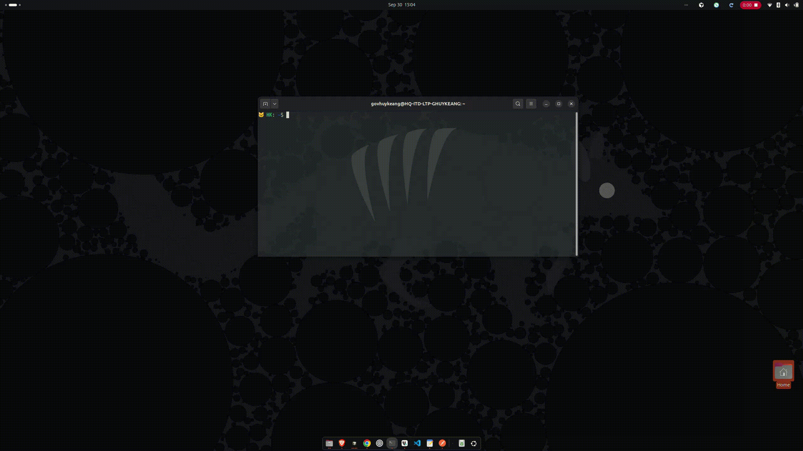

# 🐱 Meowboard

Clipboard history for GNOME. Meowboard runs in the background, keeps your last 100 copied texts, and opens with a keyboard shortcut.
- The installer writes only under your home directory. It does not use `sudo`.

## 🚀 Install

```bash
curl -fsSL https://raw.githubusercontent.com/huykeang/meow-board/main/install.sh | bash
```

The installer does not use `sudo` and only writes to your home directory. It requires a GNOME session with:

- Python 3
- PyGObject and GTK 3 (`python3-gi`, `gir1.2-gtk-3.0`)
- `libX11.so.6`

These are normally included with GNOME. If the dependency check fails, ask an administrator to install:

```bash
python3 python3-gi gir1.2-gtk-3.0 gir1.2-gdkpixbuf-2.0 libx11-6
```

## 🧩 Usage

Open Meowboard with Ctrl+Shift+Space, or run `meowboard toggle`.

## ⚙️ Settings

Open settings with the gear button in the Meowboard window. You can:

- Change the window opacity
- Show or hide previews by default
- Record a new toggle shortcut, or disable it with Backspace

Click **Apply** to save your changes.

## 📹 Demo



## 👋 Uninstall

```bash
curl -fsSL https://raw.githubusercontent.com/huykeang/meow-board/main/uninstall.sh | bash
```

This removes the app but keeps your clipboard history.

```bash
curl -fsSL https://raw.githubusercontent.com/huykeang/meow-board/main/uninstall.sh | bash -s -- --purge
```

Use `--purge` to delete the clipboard history too.
